# World of Colour

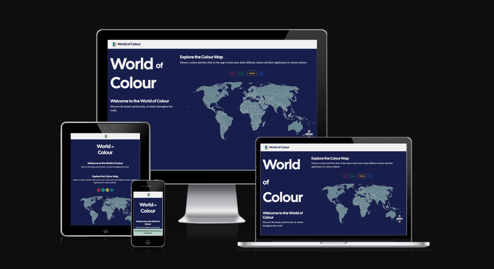

World of Colour is an interactive web project that explores the cultural meanings and symbolism of colours in different countries around the world. By selecting a colour, users can see which countries associate that colour with specific traditions, emotions, or historical events, and learn more about the stories behind these associations.

This website is designed to be both educational and visually engaging. The interface allows users to easily navigate between colours, hover over countries for quick insights, and click for in-depth information. It offers a global perspective on colour symbolism, highlighting how the same shade can carry vastly different meanings depending on cultural context.

Visit the deployed website [here](https://terebts.github.io/world-of-colour/).

## Table of Contents

1. [User Experience (UX)](#user-experience-UX)
    1. [Project Goals](#project-goals)
    2. [User Stories](#user-stories)
    3. [Color Scheme](#color-scheme)
    4. [Typography](#typography)
    5. [Wireframes](#wireframes)
2. [Features](#features)
    1. [General](#general)
    2. [Home Section](#home-section)
    3. [404 Error Page](#404-error-page)
3. [Technologies Used](#technologies-used)
    1. [Languages Used](#languages-used)
    2. [Frameworks, Libraries and Programs Used](#frameworks-libraries-and-programs-used)
4. [Testing](#testing)
    1. [Testing User Stories](#testing-user-stories)
    2. [Code Validation](#code-validation)
    3. [Accessibility](#accessibility)
    4. [Tools Testing](#tools-testing)
    5. [Manual Testing](#manual-testing)
    6. [Automated Testing](#automated-testing)
5. [Finished Product](#finished-product)
6. [Deployment](#deployment)
    1. [GitHub Pages](#github-pages)
7. [Credits](#credits)
    1. [Content](#content)
    2. [Media](#media)
    3. [Code](#code)
8. [Acknowledgements](#acknowledgements)

***

## User Experience (UX)

### Project Goals

* The website provides a clear and intuitive structure, making it easy for users to explore colour meanings across the world.

* Uses vibrant colours and smooth interactivity to engage the user and encourage exploration of the map.

* Fully responsive design ensures the interactive map is accessible and functional on different devices and screen sizes.

* Includes an information section for each country that explains the cultural significance of selected colours in an easy-to-read format.

* Offers a visually appealing and accessible way for users to learn about colour symbolism while making navigation simple and enjoyable.

### User Stories

* As a designer, I want to select a colour and see which countries have specific cultural associations with it, so that I can design with cultural awareness in mind. 

* As a designer working on a global product, I want to hover over each highlighted country and read the cultural meaning, so that I can decide whether to use that colour in my design. 

* As a creative researcher, I want to compare how one colour is perceived differently around the world, so that I can draw creative insights and inspiration.

* As a student, I want to quickly learn about colour perception in different regions.

### Color Scheme
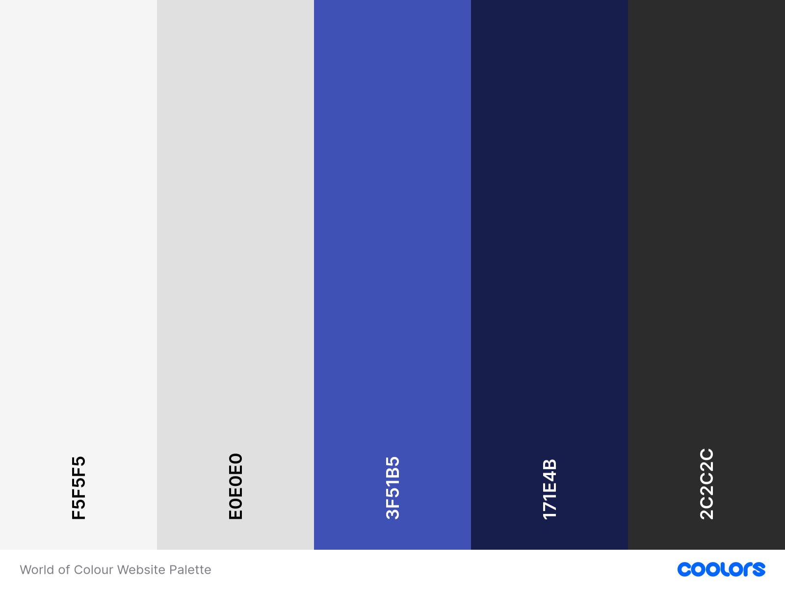

The colours used in the site are dark blue for the background and a light grey for borders/lines and for the main text. I have also used a light grey/green for the world map. These colours are chosen to provide a neutral frame (with the theme of the Earth in mind), allowing the colours on the interactive map to stand out.

### Typography

The main font used in the site is DM Serif with Sans Serif as the fallback font in case DM Serif is not being imported correctly. Cal Sans is used for the headings with Sans Serif as fall-back. 

### Wireframes

[Balsamiq](https://balsamiq.com/) has been used to plan the wireframes of the site and display the placement of the different elements.

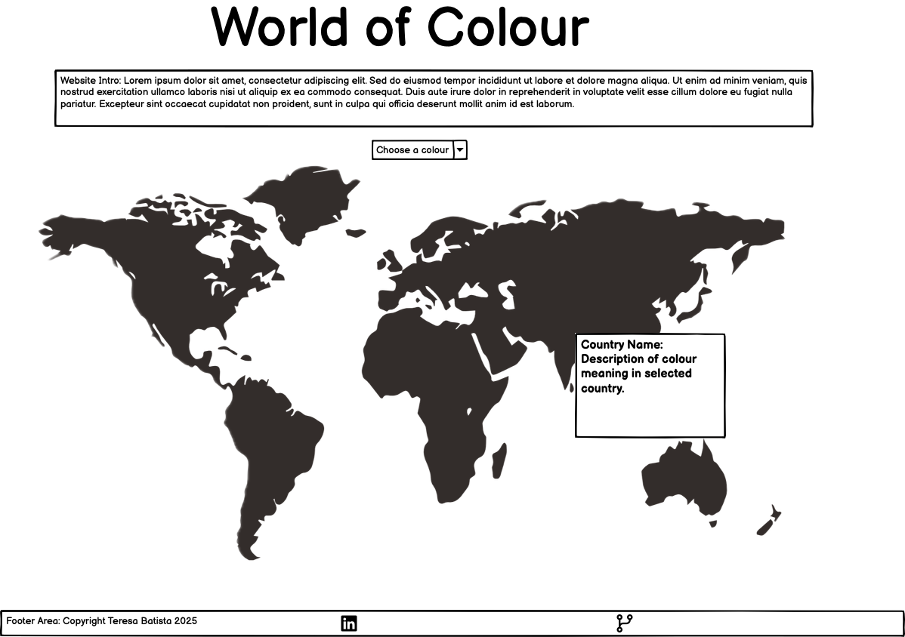

[Back to top ⇧](#world-of-colour)

## Features

### General

* The website has been designed from a mobile-first perspective.

* Responsive design ensures the map and content adapt across all device sizes.

* **Header**

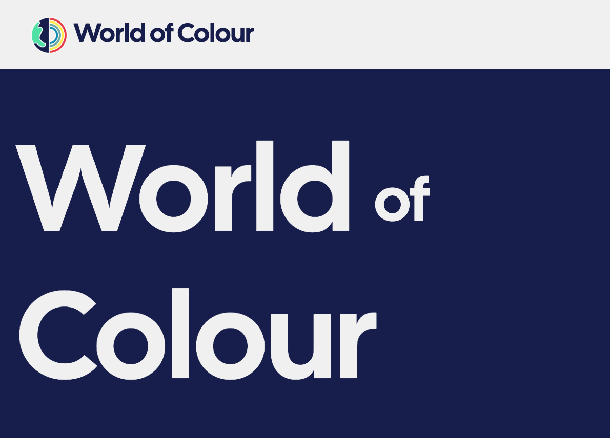
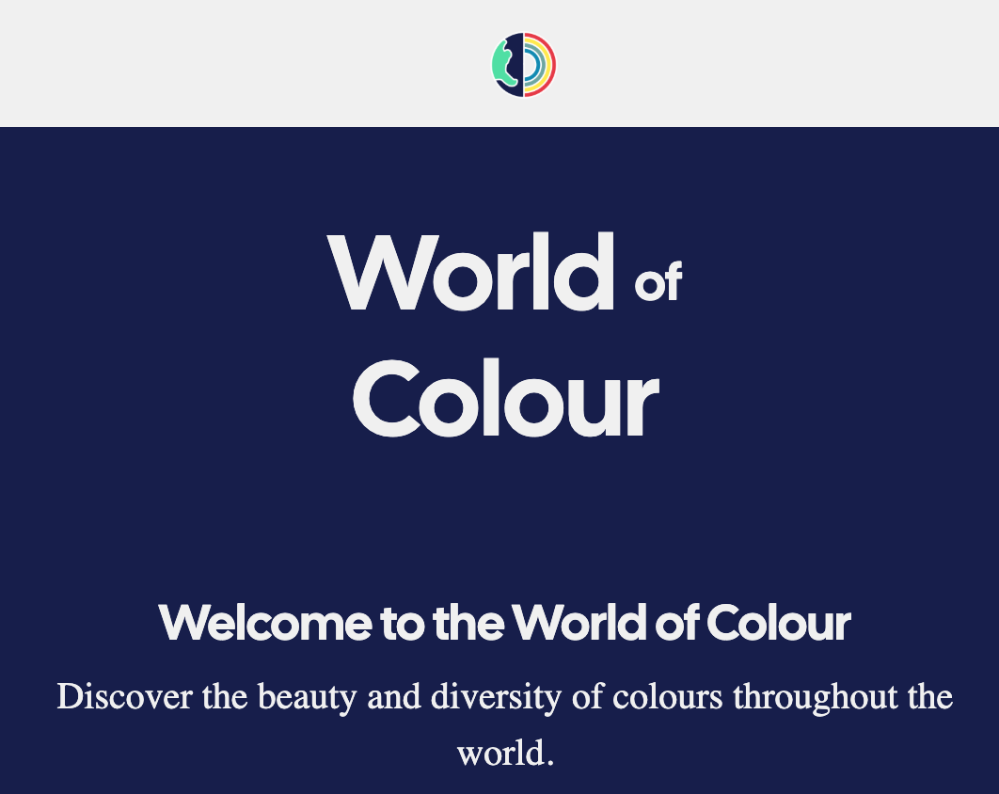

- The header contains the site’s brand logo.

- On mobile devices, the header simplifies to a central logo for a cleaner, more focused design.

* **Footer**

- The footer contains links to social media channels.

* **Background**

- The site background uses a clean, minimal colour palette to highlight the vibrant interactive map.

* **Landscape Orientation Message**

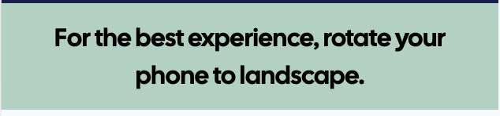

- When a mobile device is turned to landscape mode, the site displays a full-screen prompt encouraging landscape mode for optimal viewing.

### Home Section

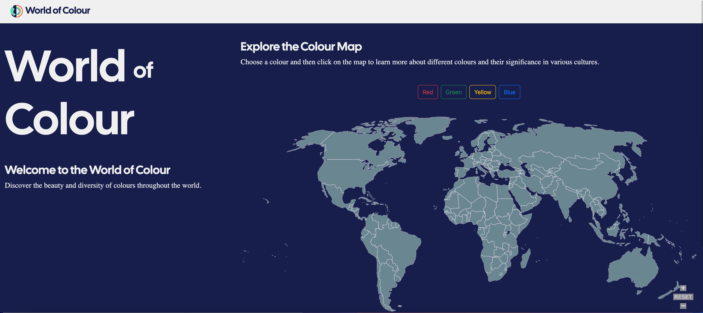

* **Introduction**

- The home section features a bold heading introducing World of Colours and its purpose.

### Interactive Map Section

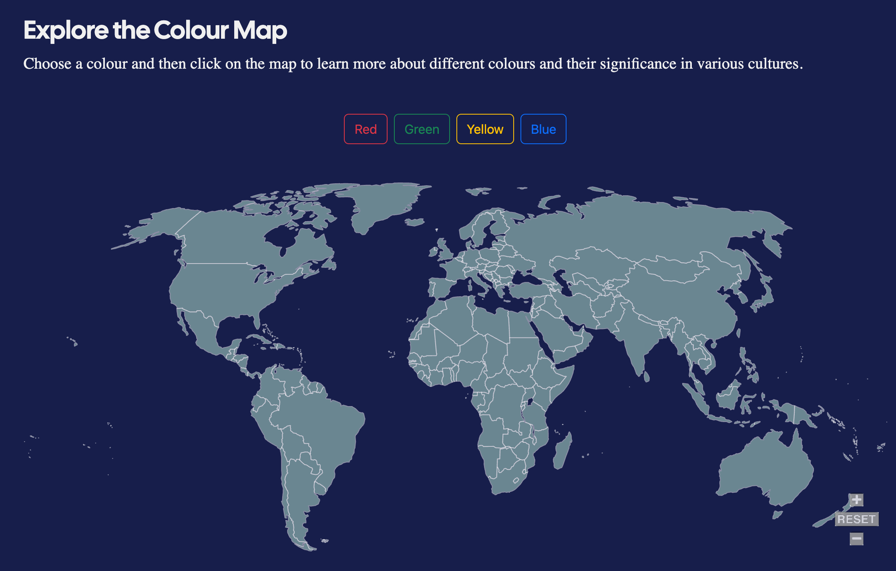
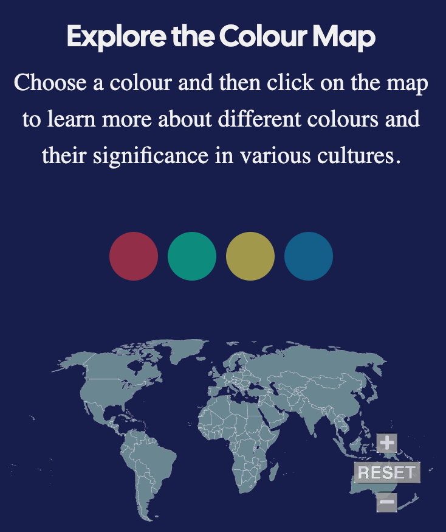

* **Colour Selector Buttons**

- Users can select a colour to see which countries associate it with cultural meaning.

- On mobile the colour selector buttons become coloured circles

- The map will then highlight with the selected colour on countries that have data relating to it. 

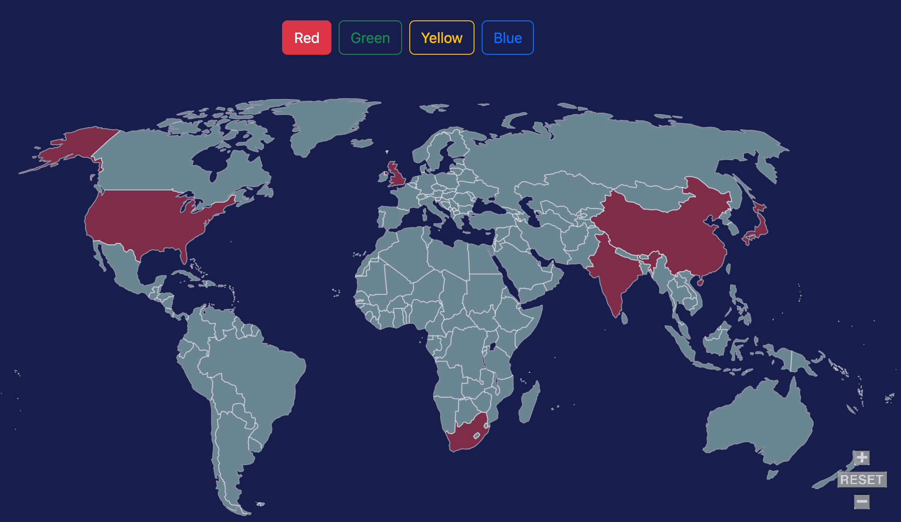

* **Interactive Country Hover**

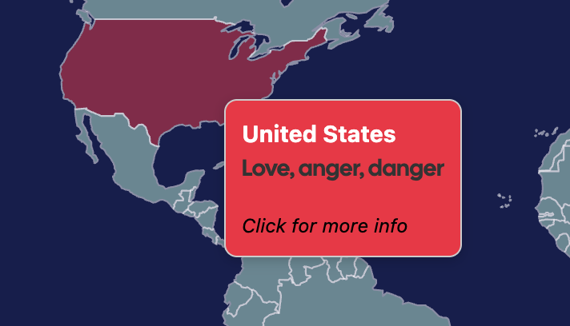

- Hovering over a highlighted country reveals the cultural meaning for the chosen colour.

* **Information Module**

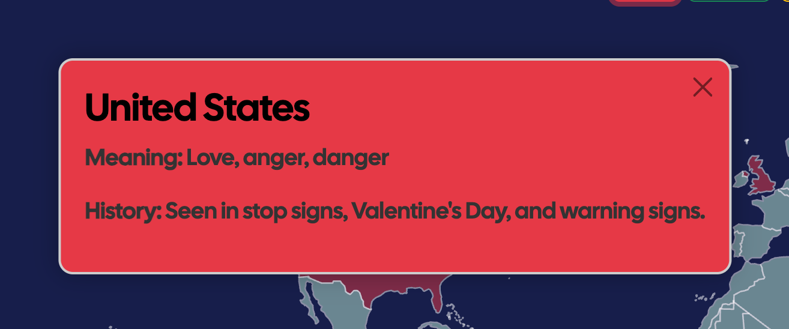

- Displays the country’s name, meaning and cultural context.

- Includes a close button for quick dismissal.

* **Responsive Map Scaling**

- The SVG map adjusts to any screen size without losing detail.

### 404 Error Page

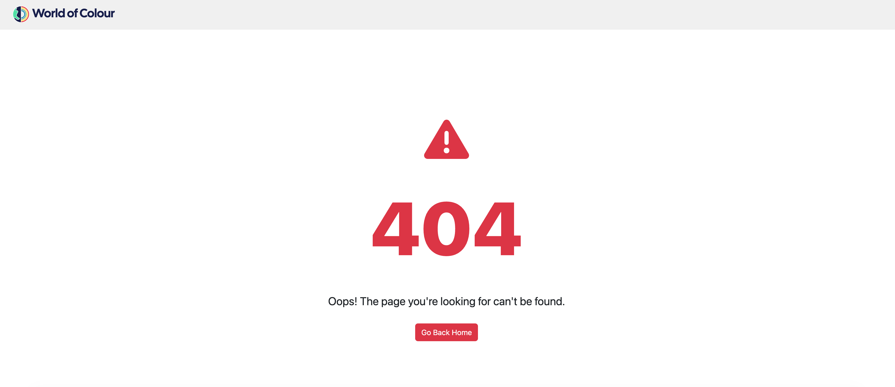

* A dedicated error page is shown if the user enters an incorrect URL.

* Includes a friendly message, an icon, and a link back to the home page.

### Future Enhancements 

* **More Content**

* Add more colours and data about more countries.

* **Multimedia Illustrations**

* Enrich country information with relevant images or embedded video links to illustrate cultural colour meanings in an engaging way.

* **Colour-Based Filtering**

* Allow users to filter countries by colour meaning (e.g., “Show all countries where red = luck”).

* **Comparison Mode**

* Add an option to compare colour meanings between two or more countries side-by-side.

* **Educational Quiz**

* Add an educational quiz or trivia game mode where users guess the meaning of a colour in a given country.

### Frameworks, Libraries and Programs Used

* [Google Fonts](https://fonts.google.com/)
    - Google Fonts was used to import the fonts Nunito and Odibee Sans into the style.css file. These fonts were used throughout the site.

* [Font Awesome](https://fontawesome.com/)
     - Font Awesome was used throughout all pages to add icons in order to create a better visual experience for UX purposes.

* [Visual Studio](https://code.visualstudio.com/)
    - Visual Studio was used for writing code, committing, and then pushing to GitHub.

* [GitHub](https://github.com/)
     - GitHub was used to store the project after pushing.

* [Balsamiq](https://balsamiq.com/)
     - Balsamiq was used to create the wireframes during the design phase of the project.

* [Am I Responsive?](http://ami.responsivedesign.is/#)
    - Am I Responsive was used in order to see responsive design throughout the process and to generate mockup imagery to be used.

* [Responsive Design Checker](https://www.responsivedesignchecker.com/)
    - Responsive Design Checker was used in the testing process to check responsiveness on various devices.

* [Chrome DevTools](https://developer.chrome.com/docs/devtools/)
    - Chrome DevTools was used during development process for code review and to test responsiveness.

* [W3C Markup Validator](https://validator.w3.org/)
    - W3C Markup Validator was used to validate the HTML code.

* [W3C CSS Validator](https://jigsaw.w3.org/css-validator/)
    - W3C CSS Validator was used to validate the CSS code.

* [ESLint] (https://eslint.org/)
    - ES Lint was installed on my VSCode project to check for errors  and validate the site's JavaScript code.

* [AdobeExpress] (https://www.adobe.com/uk/express/)
    - Adobe Express was used to source the icon used for the site's logo.

* [Procreate] (https://procreate.com/)
    - Procreate was used to finalise the colour version of the logo. 

* [SimpleMaps] (https://simplemaps.com/resources/svg-world)
    - Simple Maps was used to source the website's world map SVG. 

* [SVGPanZoom-API] (https://simplemaps.com/resources/svg-world)
    - SVG Pan Zoom API was used to facilitate the zooming and panning of the world map SVG. 

* [Bootstrap] (https://getbootstrap.com/)
    - Boostrap CSS library was used for CSS styling. 

[Back to top ⇧](#world-of-colour)

## Testing 

### Testing User Stories 

* As a designer, I want to select a colour and see which countries have specific cultural associations with it, so that I can design with cultural awareness in mind.
    - Colour selection radio buttons are provided, allowing the user to select red, green, yellow, or blue.
    - Countries associated with the selected colour are highlighted on the interactive world map.
    - Only countries related to the selected colour respond to hover or click events.
    - Hovering and clicking on highlighted countries display relevant cultural meanings and contextual information.

* As a designer working on a global product, I want to hover over each highlighted country and read the cultural meaning, so that I can decide whether to use that colour in my design.
    - Hovering over a highlighted country displays a floating hover box with the country name and brief colour meaning.
    - The hover box follows the mouse position and disappears when the cursor leaves the country.
    - On mobile, tapping a country opens the info module with full details of the colour meaning and cultural context.

* As a creative researcher, I want to compare how one colour is perceived differently around the world, so that I can draw creative insights and inspiration.
    - Users can click on a country to open a detailed information module showing the cultural meaning, historical context.
    - The information module is consistent in design, making it easy to compare data between multiple countries.

* As a student, I want to quickly learn about colour perception in different regions.
    - Interactive map highlights relevant countries for a selected colour for immediate visual understanding.
    - Hover and click interactions provide clear and concise information.
    - Background colours of info boxes match the selected colour to reinforce learning visually.
    - All interactive elements are accessible on both desktop and mobile devices.

 ### Code Validation

* The [W3C Markup Validator](https://validator.w3.org/) and [W3C CSS Validator](https://jigsaw.w3.org/css-validator/) services were used to validate all pages of the project in order to ensure there were no syntax errors.

    - W3C Markup Validator returned a series of warnings concerning several spare curly braces which I removed. The other warnings were concering the SVG that I uploaded into the project which stated "Unsupported SVG version specified. This validator only supports SVG 1.1. The recommended way to suppress this warning is to remove the version attribute altogether." and on each of the SVG paths: "Attribute name not allowed on element path at this point." I decided to leave the SVG as it was as it was not causing any issues in the functionality on the browser. If this needed to be corrected to pass a validator:
        1. I could change the version number to 1.1 or remove it all together. 
        2. I could create a javascript block to change the value "name" to "path-name" in the browser, which would then be accepted in the validator. 
    One final warning was that a heading was empty, which was because it was attached to a javascript function so this was unnecessary to change. 
    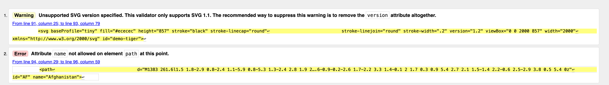
    
     - There were no warnings on the 404 page.
    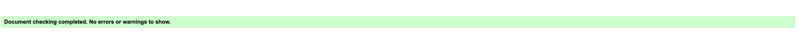

    -  W3C CSS Validator found no errors or warnings on my CSS.
    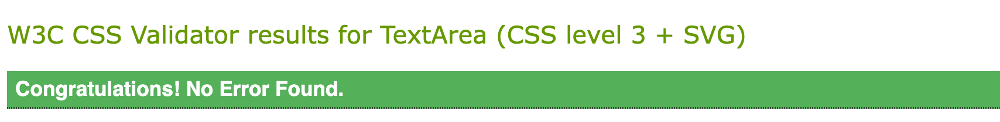

    - I used ES Lint (https://eslint.org/) to validate my javascript code by installing and initiating it directly on to my VSCode project. The validator found two warnings: 1. that a value was assigned to a const but never used - this was then deleted to remove the warning. 2. 'svgPanZoom' was not defined - to resolve this I added the comment /* global svgPanZoom */ which tells ESLint that svgPanZoom is a global variable. 
    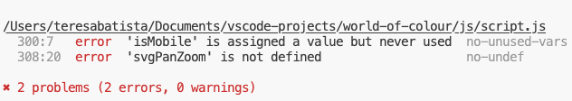

### Accessibility

* Used Lighthouse in Chrome DevTools to confirm that the colors and fonts being used in throughout the website are easy to read and accessible.

* Lighthouse reports

    - **index.html**

    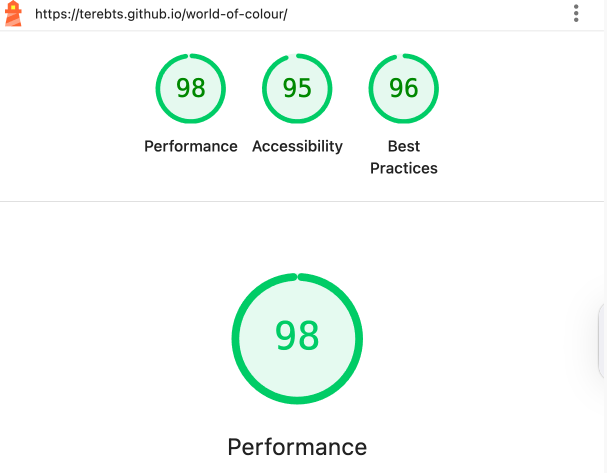

    - **404.html**

    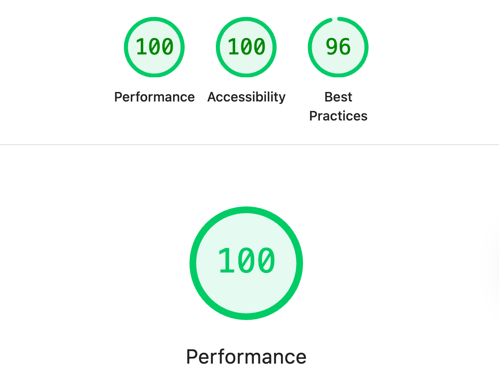

### Tools Testing

* [Chrome DevTools](https://developer.chrome.com/docs/devtools/)

    - Chrome DevTools was used during the development process to test, explore and modify HTML elements and CSS styles used in the project.

* Responsiveness

    - [Am I Responsive?](http://ami.responsivedesign.is/#) was used to check responsiveness of the site pages across different devices.

    - [Responsive Design Checker](https://www.responsivedesignchecker.com/) was used to check responsiveness of the site pages on different screen sizes.

    - Chrome DevTools was used to test responsiveness in different screen sizes during the development process.

### Manual Testing

* Browser Compatibility

Browser | Outcome | Pass/Fail  
--- | --- | ---
Google Chrome | No appearance, responsiveness nor functionality issues.| Pass
Safari | No appearance, responsiveness nor functionality issues. | Pass
Mozilla Firefox | Scrollbar is visible even though it should be hidden.  No responsiveness nor functionality issues.| Pass
Microsoft Edge | No appearance, responsiveness nor functionality issues. | Pass

* Device compatibility

Device | Outcome | Pass/Fail
--- | --- | ---
MacBook Pro 15" | No appearance, responsiveness nor functionality issues. | Pass
Dell Latitude 5300 | No appearance, responsiveness nor functionality issues. | Pass
iPad Pro 12.9" | No appearance, responsiveness nor functionality issues. | Pass
iPhone 15 Pro | No appearance, responsiveness nor functionality issues. | Pass

* Common Elements Testing

- General

 Feature | Outcome | Pass/Fail
    --- | --- | ---
Navigation Bar | All links scroll or navigate to the correct section and remain responsive at all screen sizes. | Pass
Footer Links | All external links open in a new tab. | Pass
Responsive Layout | Layout adapts correctly across desktop, tablet, and mobile screen sizes. | Pass
Bootstrap Styling | Bootstrap classes are applied consistently for spacing, typography, and buttons. | Pass

- Map Interaction

 Feature | Outcome | Pass/Fail
    --- | --- | ---
Pan & Zoom | User can pan and zoom in/out of the SVG map smoothly. | Pass
Country Hover | Hovering over a country changes its appearance (highlight/fade effect) as expected. | Pass
Hover Tooltip | Tooltip displays country name and colour meaning correctly. | Pass
Country Click | Clicking on a country opens central modal with correct historical/context information. | Pass
Modal Close Button | Closes modal and returns to map view as expected. | Pass

- Colour Selection

 Feature | Outcome | Pass/Fail
    --- | --- | ---
Colour Picker | Selecting a colour applies it to the chosen countries correctly. | Pass
Multiple Colours | Different countries can be assigned different colours without overwriting others. | Pass
Reset Colours Button | Clears all colour selections and restores default map state. | Pass

- Accessibility 
 Feature | Outcome | Pass/Fail
    --- | --- | ---
Keyboard Navigation | Tab key cycles through interactive elements in logical order. | Pass
ARIA Labels | ARIA labels are present for key elements like buttons and map controls. | Pass
High Contrast Mode | Content remains visible and usable in high-contrast display settings. | Pass

- Error Handling
Feature | Outcome | Pass/Fail
    --- | --- | ---
Broken Link Handling | Invalid URLs show a 404 page with a working link back to the home page. | Pass
Missing Data | If a country has no associated data, modal displays a friendly “No data available” message. | Pass

### Automated testing 

For this project, I decided not to implement automated testing as I felt that manual testing was sufficient to verify the core functionality and ensure the site worked as expected across devices and screen sizes. All key features were tested manually using the test cases listed above.

However, if I were to implement automated testing in the future, I would use Jest (https://jestjs.io/), a popular JavaScript testing framework, to write and run unit tests.

- Installing Jest on VS Code
* Ensure Node.js is installed
    Jest runs on Node.js, so make sure it is installed by running:
    - "node -v"
    - "npm -v"
    - If not installed, download and install it from nodejs.org.

* Install Jest
    Inside the project folder, run:
    - npm init -y
    - npm install --save-dev jest
    - Configure package.json

* In the package.json file, add a test script:
    "scripts": {
    "test": "jest"
    }

* Create a test file
    - Jest looks for files ending in .test.js or .spec.js.
    Example:
    // helpers.test.js
    const getCountryColour = require("./helpers");

    test("returns correct colour for France", () => {
    expect(getCountryColour("France")).toBe("blue");
    });

    test("returns 'unknown' for a country not in the list", () => {
    expect(getCountryColour("Atlantis")).toBe("unknown");   
    });

* If run:
    "npm test"

*Jest would output something like:

    PASS  ./helpers.test.js
    ✓ returns correct colour for France (3 ms)
    ✓ returns 'unknown' for a country not in the list

[Back to top ⇧](#world-of-colour)

## Finished Product

Page / Section | Image
--- | ---
Home Page - Desktop | [Desktop version image1](assets/readme/home-final-desktop.png) [Desktop version image2](assets/readme/home-final-desktop2.png)
Home Page - Mobile | [Mobile Version Image1](assets/readme/home-mobile.jpg) [Mobile Version Image2](assets/readme/home-mobile2.jpg)
404 Error Page | 

[Back to top ⇧](#world-of-colour)

## Deployment

* This website was developed using [Visual Studio](https://visualstudio.microsoft.com/), which was then committed and pushed to GitHub using the VS terminal.

### GitHub Pages

* Here are the steps to deploy this website to GitHub Pages from its GitHub repository:

    1. Log in to GitHub and locate the [GitHub Repository](https://github.com/).

    2. At the top of the Repository, locate the Settings button on the menu.

        - Alternatively click [here](https://raw.githubusercontent.com/) for a GIF demostration of the process.

    3. Scroll down the Settings page until you locate the Pages section.

    4. Under Source, click the dropdown called None and select Master Branch.

    5. The page will refresh automatically and generate a link to your website.

[Back to top ⇧](#world-of-colour)

## Credits

### Content

[Instructions for Simple Maps SVG](https://simplemaps.com/docs/)

[World of Colour content information sources](https://informationisbeautiful.net/visualizations/colours-in-cultures/)

### Media

[Free World SVG Map](https://simplemaps.com/resources/svg-world)

[Logo symbol](https://www.adobe/uk/espress.com) 

### Code

* [Stack Overflow](https://stackoverflow.com/), [CSS-Tricks](https://css-tricks.com/) and [W3Schools](https://www.w3schools.com/) were consulted on a regular basis for inspiration and sometimes to be able to better understand the code being implement.

* [Free Code Camp](https://www.freecodecamp.org/news/how-to-make-clickable-svg-map-html-css/)

[Back to top ⇧](#world-of-colour)

## Acknowledgements

* My husband, for his unconditional love, help and continued support in all aspects of life to make it possible for me to complete this project.

* My family, for their valuable opinions, critiques and support during the design and development process.

* My tutor, Marcel, for his invaluable feedback and guidance.

* Code Institute and its amazing Slack community for their support and providing me with the necessary knowledge to complete this project.

[Back to top ⇧](#world-of-colour)